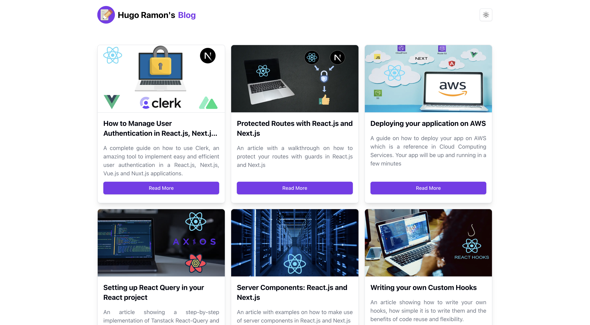
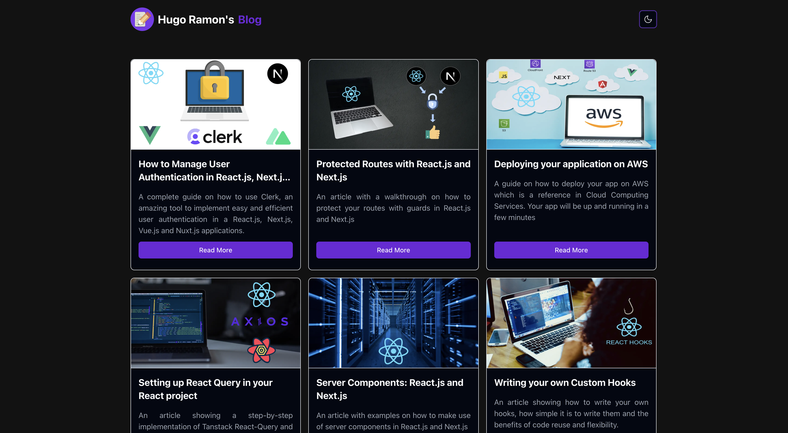

# SANITY BLOG - Hugo Ramon's Blog Posts 

### A place where you can find my articles

* #### Home page in Light Mode


* #### Home page in Dark Mode


* #### Article page in Light Mode


* #### Article page in Dark Mode


## SANITY BLOG - FRONTEND TECH STACK

<p align-items="center" justify-content="center">
  
</p>

The project was built using [React.js](https://react.dev/) and [Next.js](https://nextjs.org/) with [NPM](https://www.npmjs.com/) as our package manager.

As for the UI, we've used [Shadcn-ui](https://ui.shadcn.com/) along with [TailwindCSS](https://tailwindcss.com/).

To handle the content of the articles we used [Sanity](https://www.sanity.io/) where we added everything and shared with the Frontend application for the content to be displayed.

These are the steps to execute our project:

- To run in Development mode we use the command:

```javascript
npm run dev
```

And in our project there is a folder named **sanity-blog** which was the name we gave to it and in this folder we can cd into it and execute the command:

```javascript
npm run dev
```

And by doing so we will execute Sanity's servers where we can access:

- Structure - This is where the content is added and edited
- Vision - This is where we can access the content raw files and make queries to fecth the data content and shove it to our frontend to grab and show it.
- Schedules - This is where we can add content and schedule an incoming date for ir to do something.

# License
© Done with a lot of &#10084; by Hugo Ramon Pereira -> [Portfolio](https://hugoramonpereira.dev/) -> [LinkedIn](https://www.linkedin.com/in/hugo-ramon-pereira/) 🇧🇷 .
